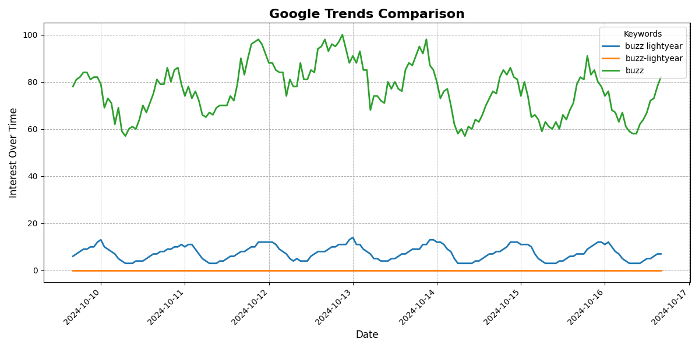
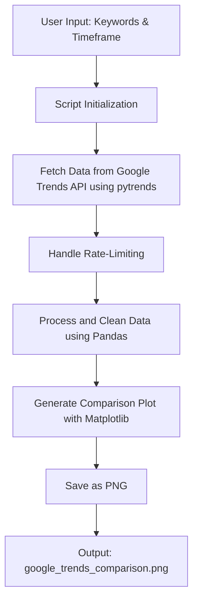
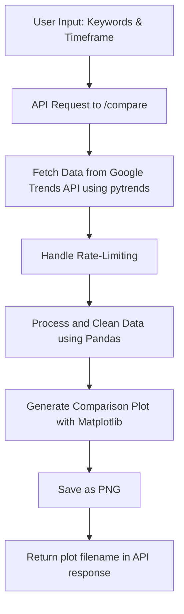

<h1 align="center">📊 <a href="https://github.com/ronknight/google-trends">Google Trends Comparison Script (Flask API with Web Interface)</a></h1>

<h4 align="center">🔧 A Python-based script to compare the popularity of multiple keywords using Google Trends data, now with a Flask web interface for easy access and visualization.</h4>

<p align="center">
  <a href="#overview">Overview</a> •
  <a href="#features">Features</a> •
  <a href="#prerequisites">Prerequisites</a> •
  <a href="#how-to-use">How to Use</a> •
  <a href="#api-endpoints">API Endpoints</a> •
  <a href="#web-interface">Web Interface</a> •
  <a href="#example-output">Example Output</a> •
  <a href="#visualization">Visualization</a> •
  <a href="#error-handling">Error Handling</a> •
  <a href="#license">License</a>
</p>

## Overview

This Python-based script allows you to compare the popularity of two or three keywords over a specified timeframe using Google Trends data. The script fetches interest over time for the provided keywords and visualizes the trends using `matplotlib`. You can now access the comparison tool via a Flask web interface, submit keywords, and display the resulting comparison image directly in your browser.

## Features

- Compare the search interest of **2 or 3 keywords** over a custom time period.
- **Supports multiple timeframes**, including the past 7 days, past 12 months, and custom date ranges.
- Outputs a **visual plot** of the trends, saved as a `.png` image.
- Uses the **Google Trends API** (`pytrends`) to fetch real-time or historical trend data.
- Provides a **Flask-based web interface** for easy access and interaction.
- Handles **rate-limiting** with an optional delay between requests to avoid being blocked by Google.

## Prerequisites

Before running the script or Flask API, ensure you have the following Python packages installed:

- `Flask`
- `Flask-CORS`
- `pytrends`
- `matplotlib`
- `pandas`

Install the required packages using:

```bash
pip install Flask Flask-CORS pytrends matplotlib pandas
```

## How to Use

### Running the Script via Web Interface

1. **Run the Flask server** to expose the web interface throughout the network:

   ```bash
   python app.py
   ```

2. Open your browser and go to `http://localhost:5000`. You’ll see a web form where you can input the keywords and select a timeframe for comparison.

3. After submitting the form, the trends comparison plot will be generated and displayed on the results page.

### Running the Script Directly

1. **Run the script** by passing at least two required keywords and an optional third keyword. Additionally, you can specify a timeframe.

2. **Command-line Usage**:

   ```bash
   python google_trends_compare.py <keyword1> <keyword2> [--keyword3 <keyword3>] [--timeframe <timeframe>]
   ```

   - `<keyword1>`: The first keyword for comparison.
   - `<keyword2>`: The second keyword for comparison.
   - `--keyword3 <keyword3>`: (Optional) A third keyword to compare.
   - `--timeframe <timeframe>`: (Optional) Specify the time range for comparison. Defaults to `today 12-m`.

3. **Example Commands**:
   
   Compare two keywords (`"Python"` and `"Java"`) over the last 7 days:
   ```bash
   python google_trends_compare.py "Python" "Java" --timeframe "now 7-d"
   ```

   Compare three keywords (`"spiderman"`, `"batman"`, `"superman"`) over the last 12 months:
   ```bash
   python google_trends_compare.py "spiderman" "batman" --keyword3 "superman" --timeframe "today 12-m"
   ```

## Web Interface

### Accessing the Web Interface

1. **Open a browser** and go to the URL `http://localhost:5000`.
2. **Fill in the form** with two or three keywords and select a timeframe from the dropdown menu.
3. Submit the form, and the **Google Trends comparison plot** will be generated and displayed on the results page.

### Example Form Inputs:

- **Keyword 1**: `Python`
- **Keyword 2**: `Java`
- **Keyword 3 (Optional)**: `JavaScript`
- **Timeframe**: `today 12-m`

### Example Output:

The script generates a comparison plot of the search trends, such as the one below:



## API Endpoints

### `/compare`

- **Method**: `POST`
- **Description**: Compare the search trends of two or three keywords over a specified timeframe and receive a plot as the output.

- **Request Body**:
  - `keywords`: A list of two or three keywords to compare.
  - `timeframe`: (Optional) The time range for comparison. Defaults to `today 12-m`.

  Example `POST` request:

  ```json
  {
    "keywords": ["Python", "Java", "JavaScript"],
    "timeframe": "today 12-m"
  }
  ```

- **Response**:

  ```json
  {
    "message": "Comparison successful",
    "image": "google_trends_comparison.png"
  }
  ```

- **Example Request** using `curl`:

  ```bash
  curl -X POST http://localhost:5000/compare \
       -H "Content-Type: application/json" \
       -d '{"keywords": ["Python", "Java"], "timeframe": "now 7-d"}'
  ```

## Visualization

The flow of the Google Trends Comparison Script is visualized below using Mermaid:



The flow of the API-based process is visualized below:



## Error Handling

- The script will handle cases where **no data is available** for the specified keywords.
- In cases where Google returns a `400` error, the timeframe or keyword formatting may be incorrect.

## License

This project is licensed under the MIT License - see the [LICENSE](LICENSE) file for details.